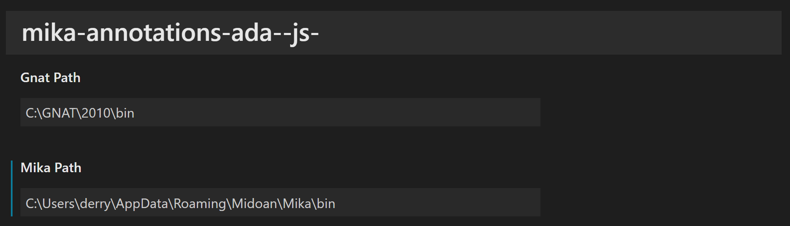
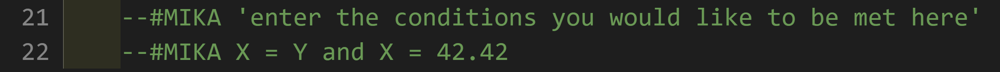

# Mika Visual Studio Code Extension

## Requirements

This extension requires 
1. [Mika](https://github.com/echancrure/Mika): Open Source Test Input Generation software
2. [GNAT 2010](https://www.adacore.com/download): GNAT is a free-software compiler for the Ada programming language
3. [Sicstus Prolog](https://sicstus.sics.se/download4.html): The necessary version of prolog to be Mika compatible

## Demonstration

A video demonstration can be found here:
[Video Demonstration](https://youtu.be/tXC2NYavy9w)

more complex boolean conditions are possible than are shown in the demonstration such as using 'and' and 'or' in your conditions also
e.g Z = 185 and Y = 37

## How to use

1. Download the repository and open the root folder in Visual Studio Code.

2. Click File -> Open Folder -> mika-annotations-ada--js-

3. Once this is opened in Visual Studio Code you can run the extension in developer mode by pressing F5
    1. If Mika or Gnat are installed in a non default directory you will need to update their paths within the extensions settings
    2. File -> Preferences -> Settings -> Extensions dropdown sub menu -> mika-annotations-ada--js-
    
    Default GNAT path: "C:\\GNAT\\2010\\bin"
    Default Mika path: "%appdata%\\Roaming\\Midoan\\Mika\\bin"

4. This will open up a new instance of VS Code in developer mode, in there open up an Ada file to work with.

5. Once open you can select a line number you wish to query the code variables on, to insert a comment, press F1 and select Mika Ada Annotations. This will insert a boilerplate comment into the code and you just need to overwrite the text within the '' with a boolean condition from the code under test, do not include the quotation marks or parentheses or semi colons. 
Example of comment before and after:

6. Once a comment has been entered open the command palette with F1 and run Mika generate test inputs

7. Test inputs to satisfy your query will be displayed in a tab next to your source code and this can be saved in a location of your choosing through VS Code.