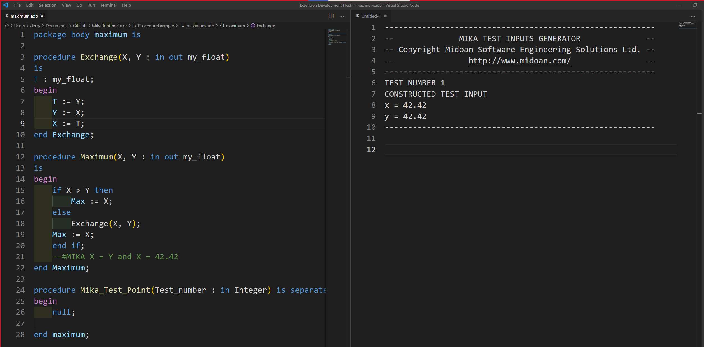

# mika-annotations-ada--js- README

This extension allows you to insert comments into your Ada code and generate test inputs to make the boolean condition in the comment true at the line of code the comment was entered on.

## Features

## Requirements

This extension requires 
1. [GNAT 2010](https://www.adacore.com/download)
2. [Mika](https://github.com/echancrure/Mika)

## Extension Settings

This extension contributes the following settings:

* `mika-annotations-ada--js-.mikaPath`: Add your path to Mika 
* `mika-annotations-ada--js-.gnatPath`: Add your path to GNAT

## Known Issues

Comment added needs to be valid Ada for your file under test, correct types and syntax etc.

## Limitations

1. Currently only one comment can be handled at a time
2. All Mika limitations also apply

## Release Notes

### 1.0.0

Initial release of mika-annotations-ada--js-

